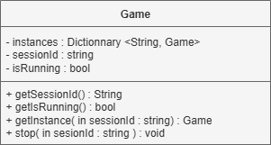
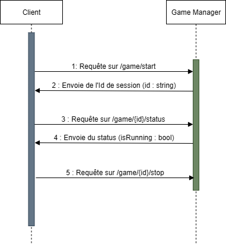

# Game Manager

### Fonctionnement
Le module permet de lancer des sessions de parties et de les arréter.

### Routes
GET /game/start         => Permet de lancer une session et retourne l'id de session  
GET /game/{id}/stop     => Permet d'arréter une session de jeu (la variable isRunning passe à faux)  
GET /game/{id}/status   => Retourne le status (valeur de la variable isRunning)  

### Diagramme de classe

### Diagramme de séquence

