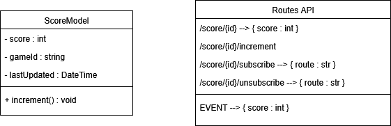

# Score Service

### Présentation
Le service initialise le score à 0.  
Il s'abonne à foodService et incrémente le score à chaque fruit manger par le snake.  
Les autres services peuvent s'abonner pour recevoir le score à chaque fois qu'il est actualisé.

### Routes

GET /score/{id} => Récupère le score  
POST /score/{id}/increment => Incrémente le score  
POST /score/{id}/subscribe => Permet aux autres services de s'abonner pour être informé du changement de score  
POST /score/{id}/unsubscribe => Permet aux autres services de résilier sont abonnement

### Diagramme de classe

