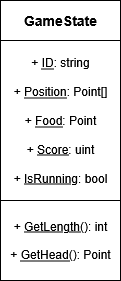
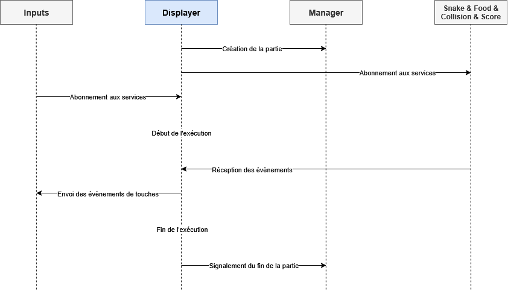

# Service 7 : Displayer

## Présentation

Ce service permet l'aggrégation des données durant une partie de Snake, ainsi que l'affichage des résultats et la prise
en compte des entrées utilisateurs. Il sera responsable de l'envoi de ces entrées au Service 2 - Player Input, qui
permettra le début de l'enchainement des différents évènements entre services.

## Low-Level Design

Le service Displayer fonctionne en proposant à la fois un serveur web permettant la communication avec les autres
services, ainsi qu'un affichage en terminal de la partie.

Afin de pouvoir s'interfacer avec les différents évènements, le serveur propose différentes routes de réception. Vous
trouverez ci-après les différentes routes proposées par l'API, ainsi que des routes permettant l'abonnement au service
pour recevoir des notifications quand l'utilisateur appuie sur une touche :

| Méthode | Chemin                        | Description                                           |
| ------- | ----------------------------- | ----------------------------------------------------- |
| ANY     | /display/{id}/on-move         | Receveur d'évènement de déplacement                   |
| ANY     | /display/{id}/on-eat          | Receveur d'évènement d'atteinte de la nourriture      |
| ANY     | /display/{id}/on-dead         | Receveur d'évènement de la mort et fin de partie      |
| ANY     | /display/{id}/on-score-change | Receveur d'évènement du changement de score           |
| ANY     | /display/{id}/subscribe       | Permet l'abonnement à l'évènement des inputs du jeu   |
| ANY     | /display/{id}/unsubscribe     | Permet le désabonnement à l'évènement d'inputs du jeu |

### Diagramme de classe

Vous trouverez ci-après une image illustrant la structure de la donnée centrale de l'application, regroupant des
informations venant de l'ensemble des services :

### Diagramme de séquence

Vous trouverez ci-dessous un diagramme de séquence illustrant les interactions du Displayer avec les autres services :

