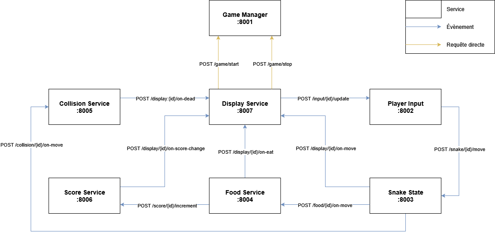

# Snake Microservices

## High-Level Design

Vous trouverez ci-dessous le schéma illustrant le HLD de la solution proposée :



## Détail des services

### 1\. Game Manager (Damien)

**Port : 8001**

Responsable du démarrage et de l’arrêt d’une partie.

- `POST /game/start` → { id: string }
- `POST /game/{id}/stop`
- `GET /game/{id}/status` → { isRunning: bool }

### 2\. Player Input (Alexis)

**Port : 8002**

Reçoit les actions clavier et les envoie au Snake.

- `POST /input/{id}/subscribe` → { route: str }
- `POST /input/{id}/unsubscribe` → { route: str }
- `POST /input/{id}/update` → \[ "up", "down", "left", "right" \]

**Event publié** :

```jsonc
{
  "direction": "up" // Valeurs possibles: up / down / right / left
}
```

### 3\. Snake State (NicolasT)

**Port : 8003**

Maintient la position du serpent et publie ses déplacements.

- `POST /snake/{id}/subscribe` → { route: str }
- `POST /snake/{id}/unsubscribe` → { route: str }
- `POST /snake/{id}/move` → { direction: "up" }

**Event publié** :

```jsonc
[
  {
    "x": 5,
    "y": 10
  }
  // ...etc.
]
```

### 4\. Food Service (AlexandreRibes)

**Port : 8004**

Génère et gère la nourriture sur la grille.

- `POST /food/{id}/subscribe` → { route: str }
- `POST /food/{id}/unsubscribe` → { route: str }
- `POST /food/{id}/on-move` → { x: int, y: int }
- `GET /food/{id}` → { x: int, y: int }

**Event publié** :

```json
{
  "x": 7,
  "y": 3
}
```

### 5\. Collision Service (NicolasH)

**Port : 8005**

Vérifie si le serpent touche un mur ou lui-même.

- `POST /collision/{id}/subscribe` → { route: str }
- `POST /collision/{id}/unsubscribe`
- `POST /collision/{id}/on-move` → \[{ x: int, y: int }\]

**Event publié** :

```jsonc
{} // Corps vide
```

### 6\. Score Service (Loïs)

**Port : 8006**

Gère le score et l’incrémente quand un fruit est mangé.

- `GET /score/{id}` → { score: int }
- `POST /score/{id}/increment`
- `POST /score/{id}/subscribe` → { route: str }
- `POST /score/{id}/unsubscribe` → { route: str }

**Event publié** :

```json
{
  "score": 10
}
```

### 7\. Display Service (Léo)

**Port : 8007**

Affiche l’état de la grille et reçoit les événements des autres services.

- `POST /display/{id}/on-move` → \[{ x: int, y: int }\]
- `POST /display/{id}/on-eat` → { x: int, y: int }
- `POST /display/{id}/on-dead`
- `POST /display/{id}/on-score-change` → { score: int }
- `POST /display/{id}/subscribe` → { route: str }
- `POST /display/{id}/unsubscribe` → { route: str }

**Event publié** :

```jsonc
[
  "a",
  "b"
  // ...etc. ; liste des touches appuyées
]
```

## Scénario de test complet

1.  `POST /game/start` → démarre une partie.
2.  `POST /input/{id}/update` → le joueur envoie une direction.
3.  `POST /snake/{id}/move` → le serpent bouge.
4.  `POST /food/{id}/on-move` → mise à jour de la position nourriture.
5.  `DELETE /food/{id}` → le serpent mange un fruit.
6.  `POST /score/{id}/increment` → le score augmente.
7.  `POST /collision/{id}/on-move` → vérifie si mort.
8.  `POST /display/{id}/on-*` → mise à jour affichage.
